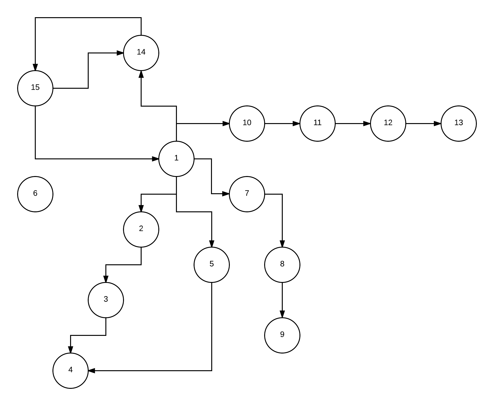

# Launching

* Launch service located in ./server/ directory using sbt
* Run ./init.sh to produce following graph:

* Run ./test_cases.sh to test server functionality

# Config

You can configure following settings in ./server/src/main/resources/application.conf:
* graph -> shortestPathMaxDepth - maximum depth to check while executing shortest path request
* graph -> operationsTimeout - maximum operations duration before failing
* http -> interface - address to start an http service
* http -> port - port to start an http service

# Methods

* GET /v1/persons - get a list of all persons
* POST /v1/persons - create a new person (example body: {"firstName":"Alex","lastName":"Pak"})
* GET /v1/persons/{id} - get a person by id
* DELETE /v1/persons/{id} - delete a person by id
* GET /v1/persons/{id}/followers - get a list of all person's followers
* POST /v1/persons/{id}/followers - add a new follower for a person (example body: {"id":<followerId as integer>})
* DELETE /v1/persons/{id}/followers/{followerId} - remove a follower from a person
* GET /v1/persons/{id1}/relation/{id2} - get a shortest relation path between person with id1 and person with id2

# Implementation details

Graph is a parent actor and vertices are his children. They are made abstract and implemented by FollowersGraph and FollowersVertex.

Algorithm for shortest path is my interpretation of distributed BFS. For this I create one aggregator actor per request. And this is single point of failure (but it should be possible to duplicate it and receive messages on all duplicates). At first I send find request to "from" vertex with target depth one. If path is not found then I send find request to "from" with target depth two and so on until max depth is reached. Requests to vertices are done in parallel and if any request can find a path then it is returned right away and the aggregator is stopped to ignore any other possible path.

The amount of work done is higher than in classical BFS but this algorithm can be distributed and paralleled.

We need to limit the algorithm because on really big graphs as social network strict algorithms do not work very well. I also considered implementing asymptotic algorithm but it requires more time and I think out of scope for a test assignment.

# Notes

* I use Int as id everywhere because it is easier to test and in one instance I can guarantee unique id with AtomicInteger but for distributed system it should be a GUID
* I create a single instance per actor but I keep in mind that all actors should be usable in cluster environment. The only problem is aggregator. It is created one per shortest path request and if it will die then request will fail
* I use streams internally to be able to process edges without loading them all in memory but while creating response I just collect everything to sequence
